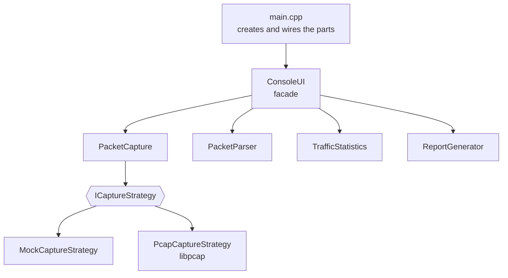

# Network Packet Sniffer

Console traffic analyzer in C++17: captures packets, parses IPv4/IPv6, TCP, UDP and ICMP headers, keeps live statistics and writes a report.

> **Context:** course project for Corporate Systems Programming at RTU MIREA; the assignment focused on modular design, build systems and testing. C++17, CMake, GoogleTest. 2026.

<!-- Add a screenshot here:  -->

## Features

- List network interfaces and pick one.
- Start and stop capture.
- Parse IPv4 and IPv6, TCP, UDP and ICMP headers; extract source and destination addresses.
- Statistics: packets per IP address, packets per protocol, total traffic in bytes.
- Export a final text report.
- Runs without libpcap in a built-in simulation mode, so it works with no drivers or root rights. With libpcap or Npcap installed it captures real traffic.

## Tech stack

| Layer | Technology |
| --- | --- |
| Language | C++17 |
| Build | CMake, CTest |
| Tests | GoogleTest 1.14, fetched automatically with FetchContent |
| Packet capture | libpcap / Npcap (optional) |
| Infrastructure | Docker multi-stage build, Docker Compose |

## Architecture



- **Strategy:** capture sits behind the `ICaptureStrategy` interface. The mock backend and the libpcap backend are interchangeable, and nothing else in the program knows which one runs.
- **Factory method:** `createCaptureStrategy()` returns the libpcap backend when CMake finds libpcap at build time, and the mock backend otherwise.
- **Facade:** `ConsoleUI` gives the user one menu and hides the four subsystems behind it.
- **Dependency injection:** `main()` builds every component and passes it in by reference, which keeps each class testable on its own.
- Strict compiler warnings: `-Wall -Wextra -Wpedantic -Wshadow -Wconversion` (`/W4` on MSVC).

## Project structure

```text
include/   headers: PacketInfo, PacketCapture, PacketParser, TrafficStatistics, ReportGenerator, ConsoleUI
src/       implementations and main.cpp
tests/
  test_*.cpp   GoogleTest unit tests, one file per class
  scenarios/   end-to-end programs: mock capture, real capture, report export, error handling
CMakeLists.txt
Dockerfile
```

## Getting started

```bash
cmake -S . -B build
cmake --build build
./build/NetworkPacketSniffer
```

For real capture, install libpcap first (`sudo apt install libpcap-dev` on Ubuntu, `brew install libpcap` on macOS, the Npcap SDK on Windows), rebuild and run with root or administrator rights. CMake detects libpcap automatically.

With Docker:

```bash
docker compose run --rm sniffer   # interactive app
docker compose run --rm test      # run the test suite
```

## Tests

54 tests: 50 unit tests across six classes and four end-to-end scenarios. They cover valid and malformed packets, unsupported protocols, empty data and error paths such as an invalid interface.

```bash
ctest --test-dir build --output-on-failure
```

## What I'd improve next

- Run the build and tests in GitHub Actions on every push.
- Read and write `.pcap` files, so captures can be opened in Wireshark.
- Add BPF filters, for example capture only `tcp port 443`.
